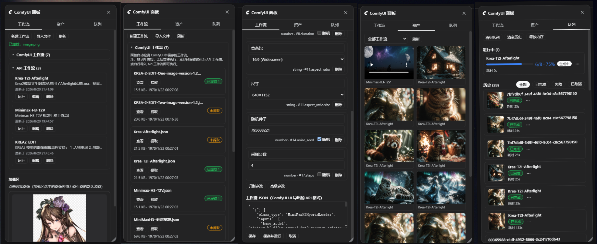

# dsh-comfyui

[English](README.en.md) | **中文**

<p align="center">
  
</p>

<h1 align="center">dsh-comfyui</h1>

<p align="center">让 DeepSeek Harness 的 Agent 智能驱动本地或远程 ComfyUI 生成任何内容。附带工作流、资产管理面板与技能包管理挂载。配套 skill 与同源媒体代理。</p>

<p align="center">
  <a href="https://www.npmjs.com/package/dsh-comfyui"></a>
  <a href="https://www.npmjs.com/package/dsh-comfyui"></a>
  
</p>

> **本仓库是 [fandc520/dsh-comfyui](https://github.com/fandc520/dsh-comfyui) 0.5.4 的 fork（huohua-dev），0.6.0 起只适配 DeepSeek Harness 0.2.0-rc.2。**
>
> | dsh-comfyui | 配对的 DeepSeek Harness |
> | --- | --- |
> | **0.6.x（本 fork，`dist` 分支）** | **0.2.0-rc.2**（peer 依赖写死该版本，无需 allow-version 豁免） |
> | 0.5.x（上游 npm） | 0.1.2 – 0.1.7 |
>
> 安装（desktop profile，装完需重启 DSH）：
> `"/Applications/DeepSeek Harness.app/Contents/Resources/runtime/cli/bin/dsh" plugin --profile desktop add github:huohua-dev/dsh-comfyui#dist`

### 0.6.0 相对上游 0.5.4 的变化

- **在对话里做视频**：内置 `h3_t2v` 模板（MiniMax H3 文生视频，10Eros TURBO），按名字传 `prompt / width / height / seconds / seed / steps`，时长按秒换算帧数（3 秒 = 73 帧，5 秒 = 124 帧）。
- **对话里管理工作流**：`comfyui_workflow` 新增 `save`（从某次运行 `prompt_id` / 内置模板 / API JSON 保存）、`update`、`delete`。
- **成片自动存到本机**：每次运行在 `archiveDir/<prompt_id>/` 下保存视频与 `meta.json`（完整工作流、seed、参数、sha256）；对话卡片优先播放本地文件，ComfyUI 关掉后历史视频照样能播、能拖进度条。
- **视频直接出现在对话里**：生成结果显示在那一轮回复的下方（和图片一样在主流程里），不用展开「思考过程」；后台任务在这里显示进度，完成后原地变成播放器。
- **后台任务适配 0.2**：任务归属当前会话，DSH 后台任务面板显示「排队中 / 采样 x/8」进度；`job_kill` 立即结束。
- **只取消自己的任务**：排队中的只从队列删除，运行中的只中断它自己（v0.39 `/api/jobs/{id}/cancel`），插件里不再有全局 interrupt。
- **路由保护**：所有 `/comfyui/*` 路由要求回环 Host、拒绝跨站请求、Origin 必须同源，并校验 DSH 登录会话；媒体路由只读插件自己归档的文件和合法的 ComfyUI `/view` 引用（防路径穿越）。**因此不再支持从局域网其它设备访问插件路由。**
- **连不上 ComfyUI 时**报错写明原因与可配置的提示（默认「win 可能在 LLM 模式，需要先运行 winmode.sh video」）。
- 设置项带说明，出现在 DSH「插件」页里本插件的设置中。

## 功能

### Agent 工具

Agent 直接驱动 ComfyUI，无需手动操作画布：

- `comfyui_run` —— 提交 API 格式工作流或内置模板（txt2img / img2img / video(Wan 2.1) / **h3_t2v** / **h3_r2v**），返回生成媒体；`mode: "sync"` 等待结果，`mode: "async"` 后台任务（视频一律用 async）。H3 模板用 `parameters` 按名字传参，时长训练范围 5–15 秒（15 秒 = 362 帧）。
  - **`h3_r2v` 参考生视频**：角色参考图 `ref_image_1..3`（第 1 张必填）+ 音色参考 `ref_audio_1` + 首/尾关键帧 `first_frame` / `last_frame` + 上一段续接 `continue_from`（末尾 22 帧与音频钉在第 0 帧），默认 480×864 竖屏 5 秒；可选位留空时整条支路从工作流里干净剪掉。提示词用官方六段式，台词写 `<d>[Chinese] …</d>`。
- `comfyui_upload` —— 把本机媒体文件（png/jpg/webp/gif/wav/mp3/flac/ogg/m4a/mp4/webm/mov/mkv，≤200MB）上传到 ComfyUI 的 input 目录，可选一层 `subfolder` 与 `overwrite`，返回可直接填进 LoadImage / LoadAudio / LoadVideo 或模板参数的 `子目录/文件名`；图片顺带记录像素尺寸。
- `comfyui_object_info` —— 列出服务器支持的节点定义，让 Agent 现场构造合法工作流。
- `comfyui_workflow` —— 管理插件工作流库：`list`（含服务器地址、本机 ComfyUI 目录、加载区素材、每个工作流的参数清单）、`run`（按 id 运行 + 参数覆盖）、**`save` / `update` / `delete`**（在对话里保存、修改、删除工作流）、`skill`（按需读取某工作流的技能包）、`refresh`（重算参数快照）。
- `comfyui_skill` —— 读写工作流技能包（`list` / `read` / `write` / `append` / `mkdir` / `rename` / `delete` / `enable` / `require`），Agent 可把踩坑经验写回技能包，跨会话复用。

### UI 面板

右侧停靠面板，三个页签：

- **工作流** —— 可运行工作流库（新建 / 编辑 / 运行 / 删除 / 导入 `.json`，标签分类 + 下拉筛选）；支持**预设导出 / 导入**：把选中的工作流（默认全选，带技能包的行有标注）连同参数与技能包打包成 `.zip` 预设包带走，导出完成后的回执显示实际打包的工作流名单、文件名、体积与警告；把预设包**拖进对话框**（或点选文件）即可整包分析、按需导入，技能包原样完整还原（上千文件的模板大包也没问题），始终创建为新工作流、不覆盖现有库；自动检测 ComfyUI 端保存的图工作流，支持**提取**为可运行工作流（画布含多个独立流程时可选整体 / 按分量 / 主流程）。
- **资产** —— 所有生成结果，预览、下载、悬停可删除（同步清理 ComfyUI 输出目录里的文件）。
- **队列** —— 实时队列 + 历史任务五态展示，支持删除 / 中断 / 重跑 / 清空 / 释放内存，插件提交的任务带进度条与预览。

点击会话头部的「ComfyUI 面板」按钮时会自动探测后端与 ComfyUI 的连接：连不上时面板自动收起（按钮不高亮），页面顶部弹出提醒（含具体原因），提示启动本机 ComfyUI（确保后端能检测到端口）或到设置页检查远程服务器地址；连接正常时静默，仅在不通→恢复时短暂显示「连接正常」。

<p align="center"></p>

### 加载区（媒体加载器）

工作流页顶部的媒体加载器，仿 ComfyUI LoadImage 节点：图片 / 视频 / 音频可视化选择（可就地试听）、粘贴上传、多加载位。已放入的素材按顺序自动填进工作流里未显式指定的加载参数——**Agent 不需要猜文件名**；未传 `width`/`height` 时自动匹配源图分辨率。上传按内容哈希去重命名。

`comfyui_workflow list` 的 `loadArea` 字段会把加载位数与内容暴露给 Agent。

### 工作流技能包（给 Agent 的说明书）

参数清单只能告诉 Agent"有哪些旋钮"，说不出"这个工作流适合什么、哪一步会翻车"。复杂工作流可以挂一个**技能包**（面板工作流卡片上点「技能包」按钮启用）：

```
<数据目录>/skills/<工作流>/
  SKILL.md          # 主文档：适用场景 / 关键参数 / 注意事项
  references/       # 参考文档：风格合集、排错记录
  assets/           # 参考图等素材（可在面板预览）
```

- **按需三级披露，不占常驻上下文**：`comfyui_workflow list` 只有一行摘要 → 选中工作流后 `action: skill` 取正文 → 正文点名某份参考文档时才读那一篇。几十个工作流各带整套文档，平时对话成本也只是一行摘要。
- **面板编辑**：左栏文件列表 + 右栏编辑器，支持导入（按扩展名自动分目录）、自定义子目录、图片预览、把整个技能包目录挪到别的盘或同步盘（设置页 `技能包目录`）。
- **Agent 也能写**：`comfyui_skill` 工具让 Agent 查看/编写技能包——踩到坑就 `append` 进 SKILL.md，下次（换个会话也一样）直接复用经验。
- **运行前必读**：可勾选「运行前必读」，勾上后 Agent 本会话没读过该技能包就调 `run` 会被拒绝并提示先读。

### 本地归档、媒体代理与设置

任务完成后，插件把媒体下载到本机 `archiveDir/<prompt_id>/`（默认 `<数据目录>/archive`），旁边的 `meta.json` 记录 prompt_id、提交给 ComfyUI 的完整工作流、参数定义与实际取值（含随机出的 seed）、每个 seed 输入和文件的 sha256。`meta.json` 在提交时就写下，DSH 中途重启也能补归档。

对话卡片优先播放 `/comfyui/archive/<prompt_id>/<文件>`（本地文件，支持 Range 拖动），本地没有时才走同源代理 `/comfyui/media` 转发 ComfyUI `/view`；代理也会先查本地归档。浏览器不直接接触 ComfyUI：无 CORS、无混合内容、API Key 不下发。归档目录不设容量上限，面板「删除资产」不会删本地归档。

DH 设置页新增 "ComfyUI" 分区：服务器地址、API Key 环境变量名、本机 ComfyUI 目录、媒体访问地址、测试连接、界面语言切换，改完即生效，无需改 `cordis.yml`。

## 安装

```sh
# web profile
dsh plugin --profile web add dsh-comfyui
# desktop profile
dsh plugin --profile desktop add dsh-comfyui
```

重启应用后：侧边栏出现面板入口，设置页出现 "ComfyUI" 分区，Agent 立即获得全部工具与配套 skill。

## 使用

直接告诉 Agent，例如：

- "用 ComfyUI 画一张红猫的图"
- "把这幅图转成赛博朋克风格"
- "把加载区这张动漫图转成真人照片，分辨率跟原图一致"
- "生成一段 480p、3 秒的视频：黄昏海边，橘猫看浪花，有海浪声"（H3，后台生成，卡片里直接播放）
- "把这个存成模板，叫海边橘猫" → "用海边橘猫模板，改成 5 秒再来一条"
- "取消刚才那个任务"（只取消它自己）
- "用我之前在 ComfyUI 里保存的 Krea-Afterlight 跑一下"（若该图还没提取，Agent 会转告你先去面板点**提取**）

远程 ComfyUI 若位于需鉴权的代理之后，通过凭据存储或 `apiKeyEnv` 指定的环境变量（默认 `COMFYUI_API_KEY`）提供密钥，绝不发给浏览器。

## 配置

`cordis.yml` 的 `comfyui` 段（多数可在设置页改）：

| 键 | 默认值 | 说明 |
| --- | --- | --- |
| `baseUrl` | `http://127.0.0.1:8188` | ComfyUI 服务器地址 |
| `apiKeyEnv` | `COMFYUI_API_KEY` | 可选 API Key 的环境变量 / 凭据名 |
| `dataDir` | *（DSH 数据目录）* | 工作流库与资产索引存放位置 |
| `comfyuiDirs` | `[]` | 本机 ComfyUI 安装目录列表（可多条），Agent 据此定位 models、自定义节点、TTS 音色库 |
| `outputDir` | `''`（自动推断） | ComfyUI 输出目录（删除资产时定位文件用） |
| `archiveDir` | `''`（默认 `dataDir/archive`） | 成片本地归档目录（绝对路径） |
| `unreachableHint` | `win 可能在 LLM 模式，需要先运行 winmode.sh video` | 连不上 ComfyUI 时附在报错后的提示 |
| `maxMediaBytes` | `536870912`（512MB） | 单个媒体文件上限（代理与归档共用） |
| `mediaHost` | `''` | 0.6.0 起不再使用（媒体 URL 都是同源相对路径） |
| `skillsDir` | `''`（默认 `dataDir/skills`） | 技能包根目录（绝对路径，可放同步盘 / 版本库） |

## 环境要求

- DeepSeek Harness（`web` / `desktop` profile）
- 一个运行中的 [ComfyUI](https://github.com/comfystack/ComfyUI) 服务器（默认 `http://127.0.0.1:8188`）
- `h3_r2v` 模板另用核心节点 `MiniMaxH3ReferenceToVideo` / `MiniMaxH3AddGuide`（同一套模型即可；可选官方 `minimax_h3_ref2va_pruned_int8_convrot.safetensors` + LoRA `minimax_h3_ref2v_turbo_4step_v0.1_comfyui_bf16.safetensors`，4 步）
- `h3_t2v` 模板需要 ComfyUI ≥ 0.39（核心节点 `MiniMaxH3ImageToVideo`）与以下模型：`10Eros_Max_h3_TURBO-hybrid_beta5_int8.safetensors`（diffusion_models）、`qwen3vl_32b_heretic_minimax_h3_nvfp4.safetensors`（text_encoders，type=minimax）、`minimax_h3_video_vae_int8_convrot.safetensors` 与 `minimax_h3_audio_vae_fp32.safetensors`（vae）
- `video` 模板需要 [ComfyUI-WanVideoWrapper](https://github.com/kijai/ComfyUI-WanVideoWrapper) 与 Wan 2.1 模型

## License

MIT